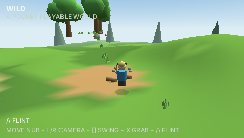
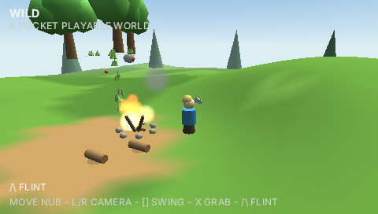
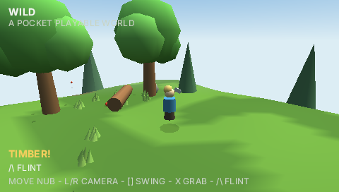
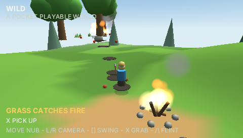

# Wild — a pocket playable world

A small meadow where the classic Breath of the Wild interactions come out of
one rule engine: chop the apple tree and it falls into a trunk you can chop
into firewood while its apples scatter and roll downhill; strike flint and
the campfire catches; leave an apple beside it and it bakes; light the grass
and the fire walks tuft-to-tuft into the orchard, shakes the apples off the
trees it takes, and leaves scorch marks and charred stumps. Nothing is
scripted pairwise — the kernel design is documented in
[docs/WILD.md](../../docs/WILD.md).






## Run it

The 3D scene needs a host with the `scene3d` surface — the desktop uihost:

```sh
bun tools/build.ts wild-main
cd engine && cargo run -p uihost --release -- --app wild-main --scale 2
```

Controls: analog nub (uihost: I/J/K/L) or d-pad to move, Q/W (L/R) to orbit
the camera, `A` (SQUARE) swings the axe, `Z` (CROSS) picks up / throws,
`S` (TRIANGLE) strikes flint.

Headless screenshots take a level-triggered input script — the blaze shot is

```sh
cargo run -p uihost --release -- --app wild-main --screenshot blaze.png \
  --frames 1000 --script "30:0:32778,93:0,120:4096,124:0,150:0:41734,235:0,250:4096,254:0"
```

On hosts without 3D (web dev host, sim) the same world runs with the HUD
over an empty viewport — `bun run dev`, then http://127.0.0.1:8130/?demo=wild-main.

## Tests

- `bun test tests/wild.test.ts` — kernel rules: the chemistry ladder, the
  grass chain, cooking, water-beats-fire, chopping substitutions, rolling,
  seeded determinism.
- `bun test tests/wild-sim.test.ts` — the bundle end-to-end in the sim host
  (renderless `s3`): byte-identical reruns, hz-invariant world trajectory.
- `bun run golden` — HUD pixel goldens for the flint journey.
